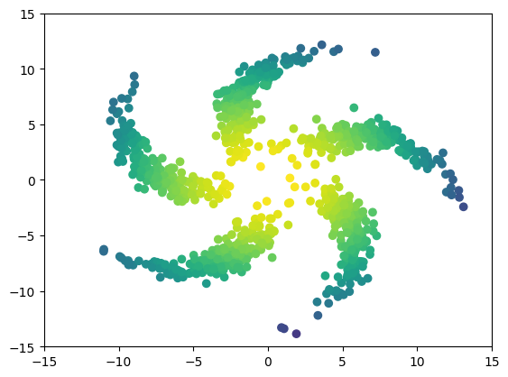
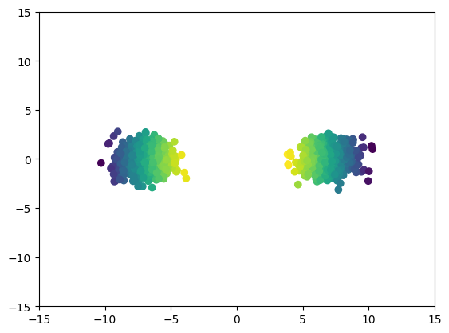
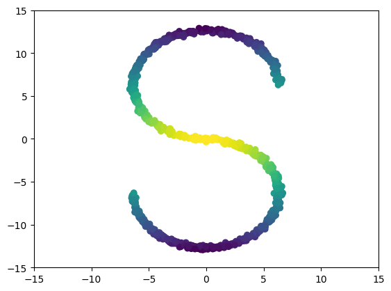
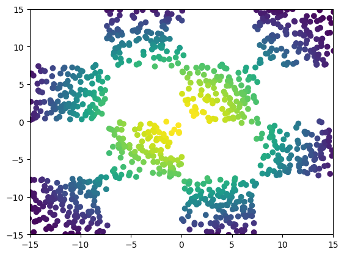

A novel interpretation of diffusion based generative modeling, extending beyond the first time reversal, enabling faster generative models and dataset interpolation / unpaired image to image translation. Accepted as a spotlight paper at NeurIPS 2021.
Paper: [https://arxiv.org/abs/2106.01357](https://arxiv.org/abs/2106.01357)
```
  @article{de2021diffusion,
  title={Diffusion Schr{\"o}dinger bridge with applications to score-based generative modeling},
  author={De Bortoli, Valentin and Thornton, James and Heng, Jeremy and Doucet, Arnaud},
  journal={Advances in Neural Information Processing Systems},
  volume={34},
  pages={17695--17709},
  year={2021}
}
```


## Contributors


Valentin De Bortoli, James Thornton, Jeremy Heng, Arnaud Doucet


## What is a Schr&ouml;dinger bridge?

The Schr&ouml;dinger Bridge (SB) problem is a classical problem appearing in
applied mathematics, optimal control and probability; see [1, 2, 3].  In the
discrete-time setting, it takes the following (dynamic) form. Consider as
reference density p(x<sub>0:N</sub>) describing the process adding noise to the
data.  We aim to find p\*(x<sub>0:N</sub>) such that p\*(x<sub>0</sub>) =
p<sub>data</sub>(x<sub>0</sub>) and p\*(x<sub>N</sub>) =
p<sub>prior</sub>(x<sub>N</sub>) and minimize the Kullback-Leibler divergence
between p\* and p. In this work we introduce **Diffusion Schrodinger Bridge**
(DSB), a new algorithm which uses score-matching approaches [4] to
approximate the *Iterative Proportional Fitting* algorithm, an iterative method
to find the solutions of the SB problem. DSB can be seen as a refinement of
existing score-based generative modeling methods [5, 6].


## Two dimensional examples

<p float="left">
  
   
</p>

<p float="left">
  
   
</p>

<p float="left">
  
   
</p>

<p float="left">
  
   
</p>

<p float="left">
  
   
</p>

<p float="left">
  
   
</p>

<p float="left">
  
   
</p>

<p float="left">
  
   
</p>

## MNIST example


## Dataset interpolation

<p float="left">
  
  
  
</p>

<p float="left">
  
  
  
</p>

<p float="left">
  
  
  
</p>


## References


 [1] Hans F&ouml;llmer
       *Random fields and diffusion processes*
       In: École d'été de Probabilités de Saint-Flour 1985-1987

 [2] Christian Léonard 
       *A survey of the Schr&ouml;dinger problem and some of its connections with optimal transport*
       In: Discrete & Continuous Dynamical Systems-A 2014

 [3] Yongxin Chen, Tryphon Georgiou and Michele Pavon
       *Optimal Transport in Systems and Control*
       In: Annual Review of Control, Robotics, and Autonomous Systems 2020

 [4] Aapo Hyv&auml;rinen and Peter Dayan
       *Estimation of non-normalized statistical models by score matching*
       In: Journal of Machine Learning Research 2005

 [5] Yang Song and Stefano Ermon
       *Generative modeling by estimating gradients of the data distribution*
       In: Advances in Neural Information Processing Systems 2019

 [6] Jonathan Ho, Ajay Jain and Pieter Abbeel
       *Denoising diffusion probabilistic models*
       In: Advances in Neural Information Processing Systems 2020


